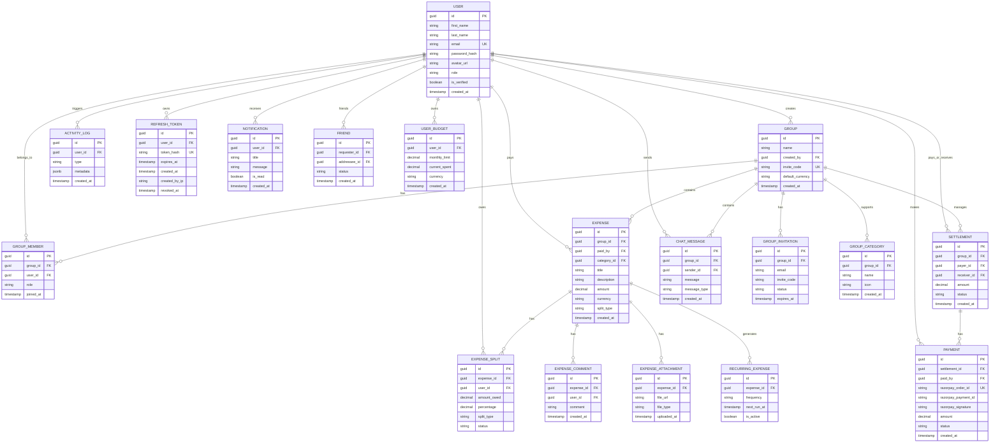

# OnlySplit API and Database Documentation

This document provides a comprehensive overview of the OnlySplit backend system, including the database schema, entity relationships, database tables, and REST API endpoints.

---

# 1. Database Schema

OnlySplit uses PostgreSQL as its primary relational database.

The architecture is designed to support:

* Secure authentication
* Group-based expense splitting
* Real-time collaboration
* Notifications
* Multi-currency support
* File uploads
* Recurring expenses
* Analytics
* Budget tracking
* Chat system
* Settlement payments
* Activity auditing

---

# 1.1 Entity Relationship Diagram (ERD)



---

# 1.2 Table Explanations

## users

Stores authentication and profile information.

## groups

Represents expense-sharing groups.

## group_members

Many-to-many relationship between users and groups.

## expenses

Stores expense transactions.

## expense_splits

Stores split calculations per user.

## expense_comments

Stores comments for discussions on expenses.

## expense_attachments

Stores receipts and uploaded files.

## recurring_expenses

Handles automatic recurring expenses.

## group_categories

Custom categories inside groups.

## settlements

Optimized debt simplification records.

## payments

Tracks Razorpay transactions.

## chat_messages

Real-time group messaging system.

## notifications

Stores in-app notifications.

## user_budgets

Tracks monthly spending budgets.

## friends

Friend request system.

## group_invitations

Email-based group invitations.

## activity_logs

Audit logs for security and tracking.

## refresh_tokens

JWT refresh token management.

---

# 2. PostgreSQL Tables

## 2.1 Users

```sql
CREATE TABLE users (
    id UUID PRIMARY KEY,
    first_name VARCHAR(100) NOT NULL,
    last_name VARCHAR(100) NOT NULL,
    email VARCHAR(255) UNIQUE NOT NULL,
    password_hash TEXT NOT NULL,
    avatar_url TEXT,
    role VARCHAR(50) DEFAULT 'user',
    is_verified BOOLEAN DEFAULT FALSE,
    created_at TIMESTAMP DEFAULT NOW()
);
```

---

## 2.2 Groups

```sql
CREATE TABLE groups (
    id UUID PRIMARY KEY,
    name VARCHAR(255) NOT NULL,
    created_by UUID REFERENCES users(id),
    invite_code VARCHAR(50) UNIQUE NOT NULL,
    default_currency VARCHAR(10) DEFAULT 'INR',
    created_at TIMESTAMP DEFAULT NOW()
);
```

---

## 2.3 Group Members

```sql
CREATE TABLE group_members (
    id UUID PRIMARY KEY,
    group_id UUID REFERENCES groups(id) ON DELETE CASCADE,
    user_id UUID REFERENCES users(id) ON DELETE CASCADE,
    role VARCHAR(50) DEFAULT 'member',
    joined_at TIMESTAMP DEFAULT NOW()
);
```

---

## 2.4 Expenses

```sql
CREATE TABLE expenses (
    id UUID PRIMARY KEY,
    group_id UUID REFERENCES groups(id) ON DELETE CASCADE,
    paid_by UUID REFERENCES users(id),
    category_id UUID,
    title VARCHAR(255) NOT NULL,
    description TEXT,
    amount DECIMAL(12,2) NOT NULL,
    currency VARCHAR(10) DEFAULT 'INR',
    split_type VARCHAR(50),
    created_at TIMESTAMP DEFAULT NOW()
);
```

---

## 2.5 Expense Splits

```sql
CREATE TABLE expense_splits (
    id UUID PRIMARY KEY,
    expense_id UUID REFERENCES expenses(id) ON DELETE CASCADE,
    user_id UUID REFERENCES users(id),
    amount_owed DECIMAL(12,2) NOT NULL,
    percentage DECIMAL(5,2),
    split_type VARCHAR(50),
    status VARCHAR(50) DEFAULT 'pending'
);
```

---

## 2.6 Expense Comments

```sql
CREATE TABLE expense_comments (
    id UUID PRIMARY KEY,
    expense_id UUID REFERENCES expenses(id) ON DELETE CASCADE,
    user_id UUID REFERENCES users(id),
    comment TEXT NOT NULL,
    created_at TIMESTAMP DEFAULT NOW()
);
```

---

## 2.7 Expense Attachments

```sql
CREATE TABLE expense_attachments (
    id UUID PRIMARY KEY,
    expense_id UUID REFERENCES expenses(id) ON DELETE CASCADE,
    file_url TEXT NOT NULL,
    file_type VARCHAR(100),
    uploaded_at TIMESTAMP DEFAULT NOW()
);
```

---

## 2.8 Recurring Expenses

```sql
CREATE TABLE recurring_expenses (
    id UUID PRIMARY KEY,
    expense_id UUID REFERENCES expenses(id) ON DELETE CASCADE,
    frequency VARCHAR(50),
    next_run_at TIMESTAMP,
    is_active BOOLEAN DEFAULT TRUE
);
```

---

## 2.9 Notifications

```sql
CREATE TABLE notifications (
    id UUID PRIMARY KEY,
    user_id UUID REFERENCES users(id) ON DELETE CASCADE,
    title VARCHAR(255) NOT NULL,
    message TEXT NOT NULL,
    is_read BOOLEAN DEFAULT FALSE,
    created_at TIMESTAMP DEFAULT NOW()
);
```

---

## 2.10 Chat Messages

```sql
CREATE TABLE chat_messages (
    id UUID PRIMARY KEY,
    group_id UUID REFERENCES groups(id) ON DELETE CASCADE,
    sender_id UUID REFERENCES users(id),
    message TEXT NOT NULL,
    message_type VARCHAR(50) DEFAULT 'text',
    created_at TIMESTAMP DEFAULT NOW()
);
```

---

## 2.11 User Budgets

```sql
CREATE TABLE user_budgets (
    id UUID PRIMARY KEY,
    user_id UUID REFERENCES users(id) ON DELETE CASCADE,
    monthly_limit DECIMAL(12,2),
    current_spent DECIMAL(12,2) DEFAULT 0,
    currency VARCHAR(10) DEFAULT 'INR',
    created_at TIMESTAMP DEFAULT NOW()
);
```

---

## 2.12 Friends

```sql
CREATE TABLE friends (
    id UUID PRIMARY KEY,
    requester_id UUID REFERENCES users(id),
    addressee_id UUID REFERENCES users(id),
    status VARCHAR(50) DEFAULT 'pending',
    created_at TIMESTAMP DEFAULT NOW()
);
```

---

# 3. API Documentation

All APIs are prefixed with `/api`.

Protected routes require:

```http
Authorization: Bearer <ACCESS_TOKEN>
```

---

# 3.1 Authentication APIs

| Endpoint                  | Method | Description                |
| ------------------------- | ------ | -------------------------- |
| /api/auth/signup          | POST   | Register new user          |
| /api/auth/login           | POST   | Login user                 |
| /api/auth/refresh         | POST   | Refresh access token       |
| /api/auth/logout          | POST   | Logout user                |
| /api/auth/me              | GET    | Current authenticated user |
| /api/auth/verify-email    | POST   | Verify email OTP           |
| /api/auth/forgot-password | POST   | Forgot password            |
| /api/auth/reset-password  | POST   | Reset password             |

---

## Signup Example

```bash
curl -X POST http://localhost:5000/api/auth/signup \
-H "Content-Type: application/json" \
-d '{
  "firstName": "Aditya",
  "lastName": "Rathod",
  "email": "aditya@example.com",
  "password": "Password123!"
}'
```

---

# 3.2 Group APIs

| Endpoint                                | Method | Description     |
| --------------------------------------- | ------ | --------------- |
| /api/groups                             | POST   | Create group    |
| /api/groups                             | GET    | Get user groups |
| /api/groups/{id}                        | GET    | Group details   |
| /api/groups/{id}                        | PUT    | Update group    |
| /api/groups/{id}                        | DELETE | Delete group    |
| /api/groups/{id}/join                   | POST   | Join group      |
| /api/groups/{id}/leave                  | POST   | Leave group     |
| /api/groups/{id}/members                | GET    | Group members   |
| /api/groups/{id}/invite                 | POST   | Invite member   |
| /api/groups/{id}/remove-member/{userId} | DELETE | Remove member   |

---

# 3.3 Expense APIs

| Endpoint                       | Method | Description      |
| ------------------------------ | ------ | ---------------- |
| /api/expenses                  | POST   | Create expense   |
| /api/expenses/group/{groupId}  | GET    | Group expenses   |
| /api/expenses/{id}             | GET    | Expense details  |
| /api/expenses/{id}             | PUT    | Update expense   |
| /api/expenses/{id}             | DELETE | Delete expense   |
| /api/expenses/{id}/comments    | POST   | Add comment      |
| /api/expenses/{id}/attachments | POST   | Upload receipt   |
| /api/expenses/{id}/attachments | GET    | Expense receipts |

---

## Create Expense Example

```bash
curl -X POST http://localhost:5000/api/expenses \
-H "Authorization: Bearer ACCESS_TOKEN" \
-H "Content-Type: application/json" \
-d '{
  "groupId": "group-guid",
  "title": "Dinner",
  "description": "Saturday dinner",
  "amount": 3000,
  "currency": "INR",
  "splitType": "equal",
  "splits": [
    {
      "userId": "user-1"
    },
    {
      "userId": "user-2"
    }
  ]
}'
```

---

# 3.4 Settlement APIs

| Endpoint                                    | Method | Description                 |
| ------------------------------------------- | ------ | --------------------------- |
| /api/settlements/group/{groupId}            | GET    | Pending settlements         |
| /api/settlements/group/{groupId}/balances   | GET    | Net balances                |
| /api/settlements/group/{groupId}/regenerate | POST   | Recalculate balances        |
| /api/settlements/{id}/pay                   | POST   | Initiate settlement payment |

---

# 3.5 Payment APIs

| Endpoint                   | Method | Description           |
| -------------------------- | ------ | --------------------- |
| /api/payments/create-order | POST   | Create Razorpay order |
| /api/payments/verify       | POST   | Verify payment        |
| /api/payments/history      | GET    | Payment history       |
| /api/payments/refund/{id}  | POST   | Refund payment        |

---

# 3.6 Notification APIs

| Endpoint                     | Method | Description                 |
| ---------------------------- | ------ | --------------------------- |
| /api/notifications           | GET    | User notifications          |
| /api/notifications/{id}/read | PUT    | Mark notification as read   |
| /api/notifications/read-all  | PUT    | Mark all notifications read |

---

# 3.7 Chat APIs

| Endpoint                  | Method | Description    |
| ------------------------- | ------ | -------------- |
| /api/chat/group/{groupId} | GET    | Group messages |
| /api/chat/group/{groupId} | POST   | Send message   |
| /api/chat/message/{id}    | DELETE | Delete message |

---

# 3.8 Budget APIs

| Endpoint          | Method | Description         |
| ----------------- | ------ | ------------------- |
| /api/budgets      | POST   | Create budget       |
| /api/budgets/me   | GET    | Current user budget |
| /api/budgets/{id} | PUT    | Update budget       |
| /api/budgets/{id} | DELETE | Delete budget       |

---

# 3.9 Friend APIs

| Endpoint                 | Method | Description         |
| ------------------------ | ------ | ------------------- |
| /api/friends/request     | POST   | Send friend request |
| /api/friends/accept/{id} | POST   | Accept request      |
| /api/friends/reject/{id} | POST   | Reject request      |
| /api/friends/list        | GET    | Friend list         |

---

# 3.10 Recurring Expense APIs

| Endpoint                     | Method | Description              |
| ---------------------------- | ------ | ------------------------ |
| /api/recurring-expenses      | POST   | Create recurring expense |
| /api/recurring-expenses      | GET    | List recurring expenses  |
| /api/recurring-expenses/{id} | PUT    | Update recurring expense |
| /api/recurring-expenses/{id} | DELETE | Delete recurring expense |

---

# 4. Enumerations

## Split Types

* equal
* exact
* percentage
* shares

---

## Settlement Statuses

* pending
* completed
* cancelled

---

## Payment Statuses

* pending
* completed
* failed
* refunded
* cancelled

---

## Group Member Roles

* owner
* admin
* member

---

## Friend Request Statuses

* pending
* accepted
* rejected
* blocked

---

## Notification Types

* expense_added
* payment_received
* settlement_created
* member_joined
* friend_request
* budget_alert

---

# 5. Recommended Backend Architecture

```text
src/
 ├── Controllers/
 ├── Services/
 ├── Repositories/
 ├── Entities/
 ├── DTOs/
 ├── Middleware/
 ├── Configurations/
 ├── SignalR/
 ├── Helpers/
 ├── Validators/
 ├── BackgroundJobs/
 └── Migrations/
```

---

# 6. Recommended Technologies

| Feature           | Technology            |
| ----------------- | --------------------- |
| Backend           | ASP.NET Core Web API  |
| Database          | PostgreSQL            |
| ORM               | Entity Framework Core |
| Authentication    | JWT + Refresh Tokens  |
| Real-time Chat    | SignalR               |
| Payments          | Razorpay              |
| File Uploads      | Cloudinary / AWS S3   |
| Background Jobs   | Hangfire              |
| Logging           | Serilog               |
| Validation        | FluentValidation      |
| API Documentation | Swagger               |
| Containerization  | Docker                |
| Reverse Proxy     | Nginx                 |

---

# 7. Future Improvements

* AI smart expense split suggestions
* OCR receipt scanning
* Voice expense creation
* Mobile push notifications
* WebSocket live balance updates
* Advanced analytics dashboard
* Subscription billing system
* Multi-language support
* Offline sync support
* Export reports as PDF/Excel

---

# 8. Security Best Practices

* Use HTTPS everywhere
* Hash passwords using BCrypt
* Store refresh tokens securely
* Rate-limit authentication APIs
* Validate uploaded files
* Use role-based authorization
* Add request logging
* Use secure cookie policies
* Add email verification
* Enable CORS restrictions

---

# 9. Conclusion

OnlySplit is designed as a scalable, production-ready expense splitting platform inspired by modern fintech architectures.

The system supports:

* Group expense management
* Smart settlements
* Secure authentication
* Real-time collaboration
* Payments integration
* Notifications
* Analytics
* Budget tracking
* Chat system
* Extensible modular backend architecture
