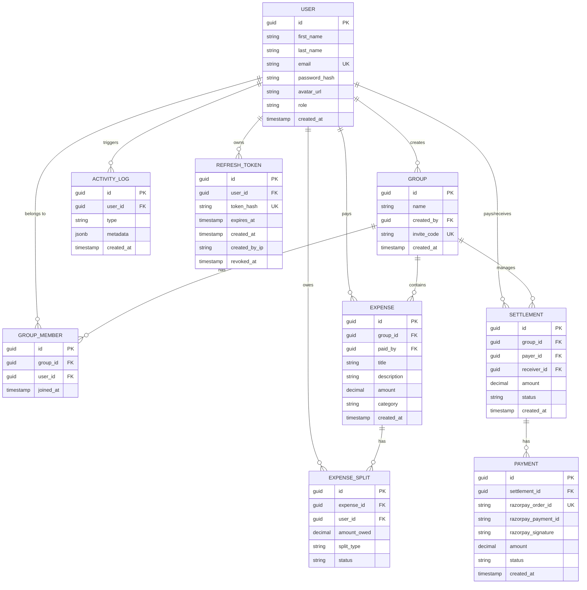

# OnlySplit API and Database Documentation

This document provides a comprehensive overview of the OnlySplit backend system, including the database schema, entity relationships, and API endpoints with example usage.

## 1. Database Schema

OnlySplit uses **PostgreSQL** as its primary database. The schema is designed for scalability and maintains strict referential integrity.

### 1.1 Entity Relationship Diagram (ERD)



### 1.2 Table Explanations

- **users**: Stores user profiles and authentication data.
- **groups**: Collaborative spaces for splitting expenses. Each group has a unique `invite_code`.
- **group_members**: Junction table for Many-to-Many relationship between Users and Groups.
- **expenses**: Core entity representing a transaction within a group.
- **expense_splits**: Records how an expense is divided among group members.
- **settlements**: Calculated optimal payments needed to resolve all debts within a group.
- **payments**: Transactional records for settlements, integrated with Razorpay.
- **activity_logs**: Audit trail for significant events (e.g., group created, expense added).
- **refresh_tokens**: Used for secure, long-lived authentication sessions.

---

## 2. API Documentation

All APIs are prefixed with `/api`. Protected endpoints require a Bearer Token in the `Authorization` header.

### 2.1 Authentication

| Endpoint | Method | Description |
| :--- | :--- | :--- |
| `/api/auth/signup` | POST | Register a new user |
| `/api/auth/login` | POST | Authenticate and get tokens |
| `/api/auth/refresh` | POST | Refresh an expired access token |
| `/api/auth/logout` | POST | Invalidate refresh token |
| `/api/auth/me` | GET | Get current user profile |

#### Register User
```bash
curl -X POST http://localhost:5000/api/auth/signup \
-H "Content-Type: application/json" \
-d '{
  "firstName": "John",
  "lastName": "Doe",
  "email": "john@example.com",
  "password": "Password123!",
  "avatarUrl": "https://example.com/avatar.png"
}'
```

#### Login
```bash
curl -X POST http://localhost:5000/api/auth/login \
-H "Content-Type: application/json" \
-d '{
  "email": "john@example.com",
  "password": "Password123!"
}'
```

---

### 2.2 Groups

| Endpoint | Method | Description |
| :--- | :--- | :--- |
| `/api/groups` | POST | Create a new group |
| `/api/groups` | GET | List user's groups |
| `/api/groups/{id}` | GET | Get group details by ID |
| `/api/groups/{id}/invite` | POST | Invite member by email |
| `/api/groups/{id}/join` | POST | Join group using invite code |

#### Create Group
```bash
curl -X POST http://localhost:5000/api/groups \
-H "Authorization: Bearer {{ACCESS_TOKEN}}" \
-H "Content-Type: application/json" \
-d '{ "name": "Trip to Goa" }'
```

#### Join Group
```bash
curl -X POST http://localhost:5000/api/groups/{{GROUP_ID}}/join \
-H "Authorization: Bearer {{ACCESS_TOKEN}}" \
-H "Content-Type: application/json" \
-d '{ "inviteCode": "abcd123456" }'
```

---

### 2.3 Expenses

| Endpoint | Method | Description |
| :--- | :--- | :--- |
| `/api/expenses` | POST | Create an expense |
| `/api/expenses/group/{groupId}` | GET | List expenses in a group |
| `/api/expenses/{id}` | PUT | Update an expense |
| `/api/expenses/{id}` | DELETE | Delete an expense |

#### Create Expense (Equal Split)
```bash
curl -X POST http://localhost:5000/api/expenses \
-H "Authorization: Bearer {{ACCESS_TOKEN}}" \
-H "Content-Type: application/json" \
-d '{
  "groupId": "3fa85f64-5717-4562-b3fc-2c963f66afa6",
  "title": "Dinner at Taj",
  "amount": 1500,
  "category": "Food",
  "splitType": "equal",
  "splits": [
    { "userId": "user-guid-1" },
    { "userId": "user-guid-2" }
  ]
}'
```

---

### 2.4 Settlements & Balances

| Endpoint | Method | Description |
| :--- | :--- | :--- |
| `/api/settlements/group/{groupId}/balances` | GET | Get net balances for all members |
| `/api/settlements/group/{groupId}` | GET | List pending settlements |
| `/api/settlements/group/{groupId}/regenerate` | POST | Re-calculate optimal settlements |

#### Get Balances
```bash
curl -X GET http://localhost:5000/api/settlements/group/{{GROUP_ID}}/balances \
-H "Authorization: Bearer {{ACCESS_TOKEN}}"
```

---

### 2.5 Payments (Razorpay)

| Endpoint | Method | Description |
| :--- | :--- | :--- |
| `/api/payments/create-order` | POST | Create a Razorpay Order |
| `/api/payments/verify` | POST | Verify payment signature |
| `/api/payments/history` | GET | Get user payment history |

#### Create Order
```bash
curl -X POST http://localhost:5000/api/payments/create-order \
-H "Authorization: Bearer {{ACCESS_TOKEN}}" \
-H "Content-Type: application/json" \
-d '{ "settlementId": "3fa85f64-5717-4562-b3fc-2c963f66afa6" }'
```

#### Verify Payment
```bash
curl -X POST http://localhost:5000/api/payments/verify \
-H "Authorization: Bearer {{ACCESS_TOKEN}}" \
-H "Content-Type: application/json" \
-d '{
  "razorpayOrderId": "order_ID",
  "razorpayPaymentId": "pay_ID",
  "razorpaySignature": "signature_hash"
}'
```

---

## 3. Enumerations (Constants)

### Split Types
- `equal`: Amount is divided equally among selected users.
- `exact`: Specific amounts specified for each user.
- `percentage`: Percentage of total amount specified for each user.

### Settlement Statuses
- `pending`: Settlement is calculated but not paid.
- `completed`: Payment verified and debt resolved.
- `cancelled`: Settlement invalidated by new expenses.

### Payment Statuses
- `pending`, `completed`, `failed`, `refunded`, `cancelled`.
